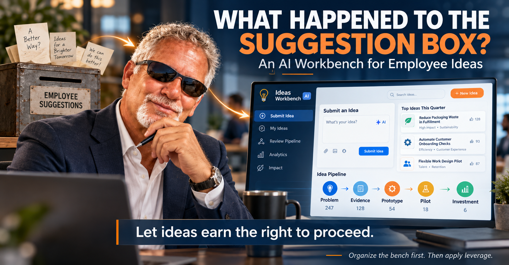

# AI Suggestion Box

An AI-powered employee suggestion workbench. Employees describe a problem, improvement idea, or opportunity they see in their daily work, and AI returns a short structured evaluation so good ideas can earn the right to proceed.

> **Status:** V1 (submission and AI evaluation) and V2 (My Ideas, Review Pipeline, Analytics, Impact) are implemented. Both have been exercised against a stand-in API; neither has yet been run against the live Anthropic API.

## Run it locally

Requires Node.js 20.12 or later.

```bash
npm install
cp .env.example .env   # then put your Anthropic API key in .env
npm start
```

Open http://localhost:3210. Set `PORT` in `.env` to use a different port.

The API key is read by the server only. It is never sent to the browser, and `.env` is git-ignored.

## What V2 adds

V2 keeps every successfully evaluated idea and makes the rest of the navigation work. The full intent is in [intentv2.md](intentv2.md).

- **My Ideas:** the ideas submitted from this browser, each with its evaluation, stage, and history. There is no sign-in, so "mine" means "from this browser".
- **Review Pipeline:** all ideas grouped by stage. Anyone can move an idea one stage forward or back; a short note is required and is kept in the idea's history.
- **Analytics:** ideas submitted, ideas per stage, ideas per recommendation, and submissions per day, all counted from stored ideas.
- **Impact:** ideas at Pilot or Investment, with a reviewer-entered outcome and estimated hours saved per week. These figures are reviewer estimates; AI does not produce them.

Ideas are stored in `data/ideas.json`, which is created on first submission and git-ignored. Delete it to start empty.

The sections below describe V1; where they say a navigation item is a placeholder or that nothing is stored, V2 supersedes them.

## Product principle

Employees submit **problems and opportunities**, not technologies. They are never asked to propose AI or to understand it. The system helps decide what deserves further investigation.

This is a workbench, not a portal, and not a chatbot.

## What V1 does

1. The employee opens the **Ideas Workbench** and sees one prominent prompt: **What's your idea or problem?**
2. They describe it in plain language, for example:
   - "We spend 10 hours every week reconciling three reports."
   - "Customers have to enter the same information twice."
   - "This approval process takes four days and usually only needs ten minutes."
3. They submit, and AI returns a concise evaluation.

There is one free-text input. There are no long forms; AI derives the structure and points out what is missing.

### The AI evaluation

| Field | Question it answers |
| --- | --- |
| Problem | What appears to be happening? |
| Who It Affects | Who experiences the problem? |
| Potential Value | Why might solving this matter? |
| Missing Evidence | What would need to be proven? |
| Smallest Next Step | What is the cheapest practical way to investigate or test the idea? |
| Recommendation | One of: Strong Candidate, Worth Exploring, Needs More Evidence, Low Value / Unclear |

Explanations stay short. The evaluation uses the Anthropic API through the simplest available integration.

### The pipeline

Every suggestion sits somewhere on this path:

**Problem → Evidence → Prototype → Pilot → Investment**

In V1 a submitted suggestion starts at **Problem**. The other stages are shown for context only; the workflow behind them is not implemented.

## Screen layout

- **Left navigation:** Submit Idea, My Ideas, Review Pipeline, Analytics, Impact. Only **Submit Idea** works in V1; the rest are visual placeholders.
- **Header:** "Ideas Workbench" with a **+ New Idea** action.
- **Main area:** the submission input, the AI evaluation, and the pipeline visual.
- **Top Ideas:** a small static set of examples, such as Reduce Packaging Waste, Automate Customer Onboarding Checks, Simplify Monthly Reporting, and Reduce Duplicate Data Entry.

## Visual direction

The app follows the concept image below in spirit and should look like a polished enterprise workbench, good enough for an executive presentation:



- dark navy navigation with a light main workspace
- blue and orange accents
- clean cards, strong typography, generous spacing
- an obvious pipeline visual and minimal clutter
- desktop-first

It should not look like a generic chatbot, like Jira, or like an experiment.

## Out of scope for V1

- full enterprise workflow, approval routing, budgeting, rewards, portfolio management
- Jira integration
- AgentCore or multi-agent orchestration
- simulation or prototyping features
- chat
- persistence, unless the first proof turns out to need it

Technical decisions belong to the implementer, with a preference for the simplest deployment architecture that supports the experience.

## Success criteria

A user can:

1. Open the workbench and immediately understand what it does.
2. Enter a real workplace problem or improvement idea.
3. Submit it with minimal interaction.
4. Receive a concise AI-generated evaluation.
5. See what evidence is missing and the smallest recommended next step.
6. See where the suggestion sits in the pipeline.

The whole experience should feel simpler than writing an email or preparing a PowerPoint proposal.

**V1 stops** when the submission experience and AI evaluation work cleanly and the app visually resembles the concept. Enterprise workflow features belong to later, evidence-driven versions.

## Repository contents

| Path | What it is |
| --- | --- |
| [server.js](server.js) | Serves the page, stores ideas, and makes the one Anthropic API call when an idea is submitted |
| [public/](public/) | The workbench screens: HTML, CSS, and browser script |
| [INTENT.md](INTENT.md) | Implementation-ready intent that V1 was built from |
| [intentv2.md](intentv2.md) | The V2 intent: stored ideas and the four remaining views |
| [intentv1.md](intentv1.md) | The original V1 intent; the source of truth for product meaning |
| [intent-driven-starter/](intent-driven-starter/) | Copy of the Intent-Driven Starter plugin (skills, agents, hooks) used to build from the intent |
